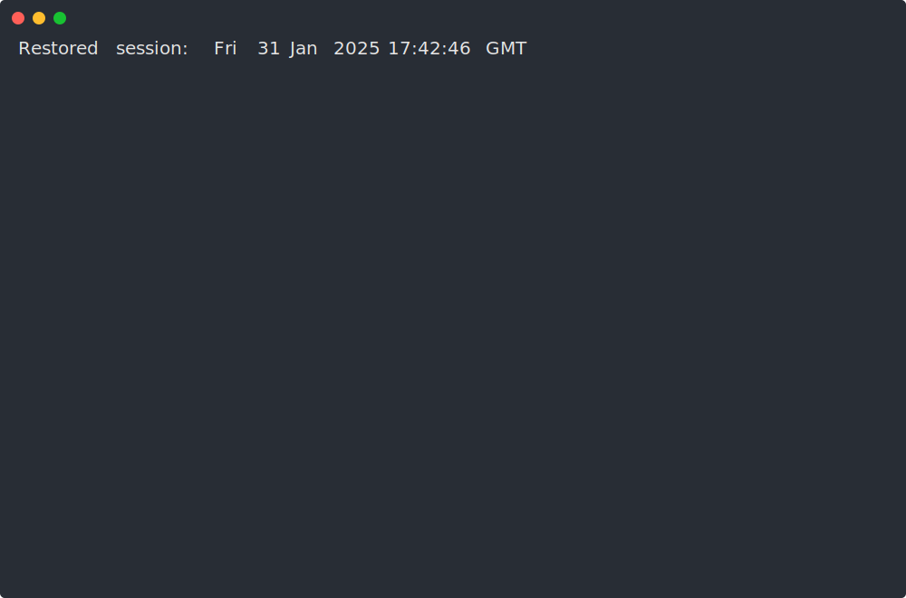
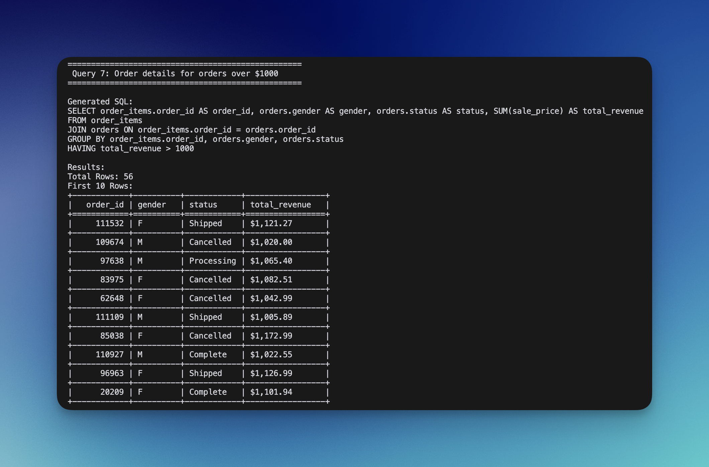

# Semantic Layer SQL Generator

A solution for generating BigQuery SQL from semantic layer definitions and queries.

## Files
- `semantic_layer.py` - Core SQL generation engine
- `test_semantic_layer.py` - Test cases and examples
- `run_sql.py` - BigQuery execution utility (provided)

## Setup

1. Install dependencies:
```bash
poetry install
# or
pip install google-cloud-bigquery tabulate python-dotenv
```

2. Set up BigQuery credentials:
.env file with `SERVICE_ACCOUNT_JSON` and `DEFAULT_DATASET`

## Running Tests

```bash
poetry run python test_semantic_layer.py
```

This will run all test cases and show:
- Generated SQL for each query
- Actual results from BigQuery
- Different types of queries (basic metrics, filters, joins, date handling)

## Example Output

